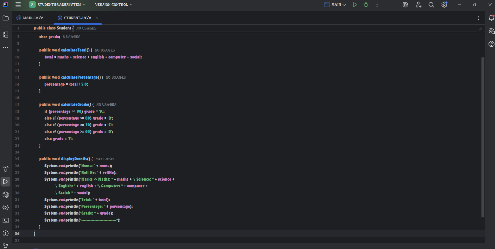
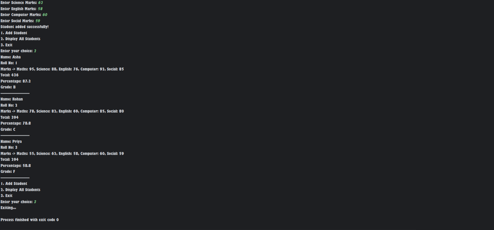
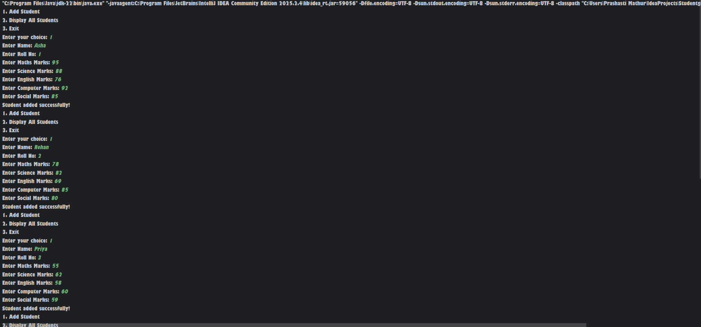

# JavaFlippedCourseProject
# Student Grade Management System

## Objective
This Java program manages student marks for 5 subjects. It calculates total marks, percentage, and grade, and displays the student report using a menu-driven system.

## How to Run
1. Open the project in IntelliJ IDEA
2. Run `Main.java`
3. Follow the menu:
   - 1 → Add Student
   - 2 → Display All Students
   - 3 → Exit

## Features
- Add student details (Name, Roll No, Marks in 5 subjects)
- Calculate total marks and percentage
- Assign grade based on percentage
- Display all students

## Screenshots

### Program Code

### Output 1

### Output 2

